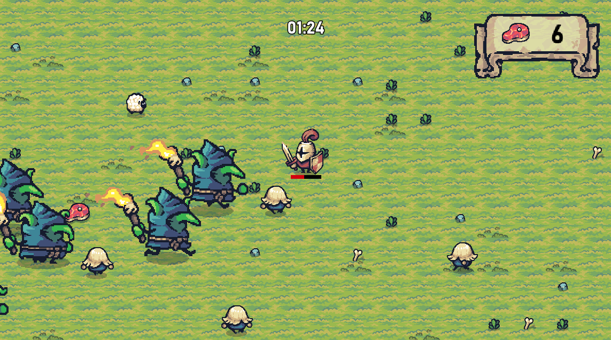
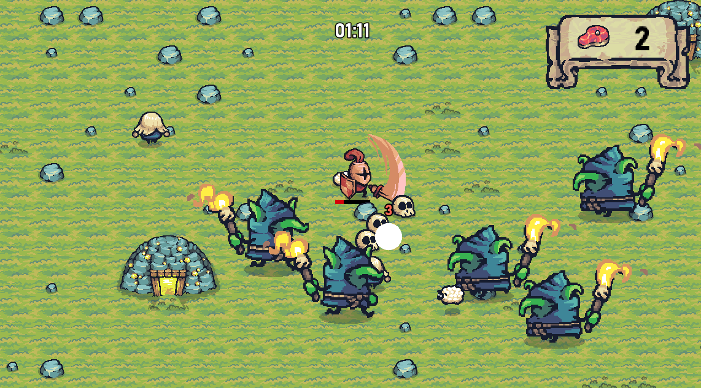
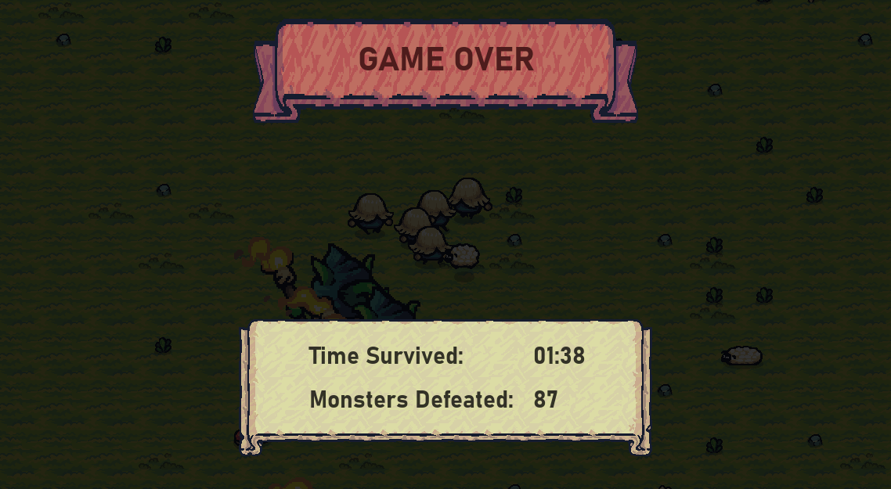

# 👾 Tiny Battle

 🎮 O projeto produzido no Godot, com o intuito educacional.
  <br/>
  <br/>
 🖥 Feito na DIO.
 <br/>
  <br/>
 🕹️ Inspirado no Vampire Survivors.


## Preview






## Controles
```
🕹️ Movimento: WASD


🕹️ Batalha: Botão esquerdo do mouse 
            ou Tecla Z.
```

## Assets 

[Tiny Swords: Pixel Frog](https://pixelfrog-assets.itch.io/tiny-swords)
<br/>
<br/>
[Kenney´s Particle Pack: by Kenney](https://kenney.nl/assets/particle-pack)

## Link do projeto

📌 [Itch.io](https://beaklotzz.itch.io/tiny-battle)

